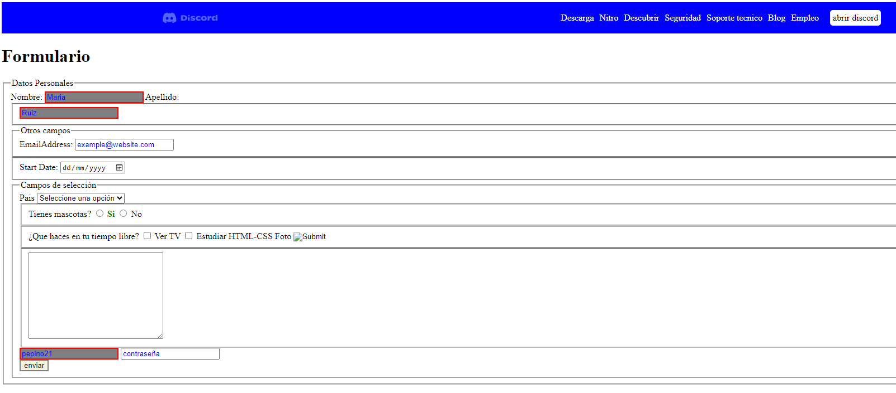

#My first HTML & CSS FORMS and Registrations. They are static as they have no Javascript applied as yet.
#The tags I've applied in it: <form>, <fieldset>, <legend>, <label>
<form action="/next-page" method="post">
  <fieldset>
    <legend>Datos Básicos</legend>
  </fieldset>
</form>

<input> tag: it is the most versatile tag, it defines a field within a form and has three main attributes:

The type attribute defines the behavior that the input will have by default. Among the most important types we have: text, checkbox, date, number, password, reset, radio, reset, submit, file...

<input type="text" name="name" id="name">
<input type="date" name="date" id="date">
<input type="number" name="price" id="price">

